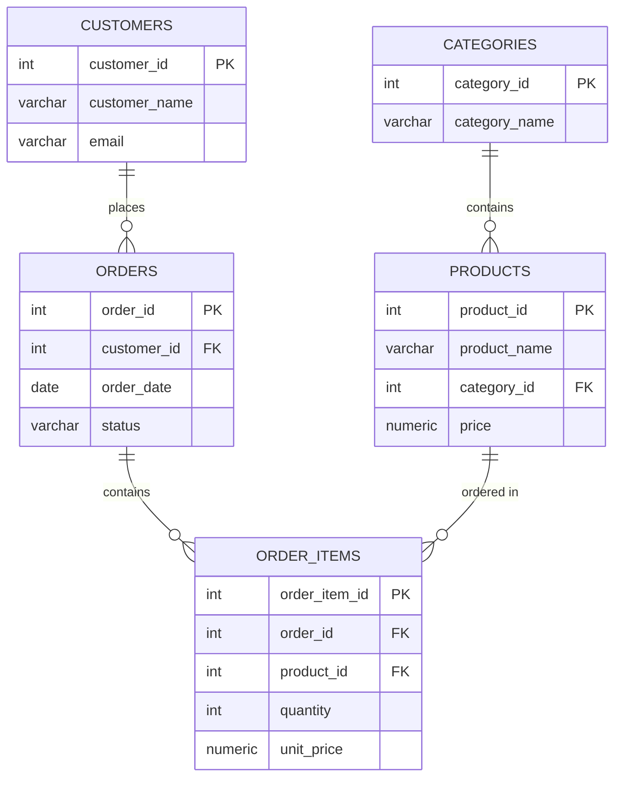

# 学習計画: DB設計/データエンジニアリング

対象テーマ: 2026年 第1弾「データ基盤構築」(SQL × データパイプライン構築 × DB設計)
現在レベル: 0 → 目標レベル: 2(このミニ課題での到達ライン)
状態: 未着手

## この課題の位置づけ

このミニ課題は「教科書」を兼ねています。下記の手順はほぼそのまま実行すれば動くように書いてあります。まずは写経して動かし、仕組みを理解した上で、合格基準にある「自分の言葉での設計判断の説明」と「サンプルデータの追加」を自力でやってください。最終的な複合成果物(Step4)でもこのスキーマを土台に使うので、ここでしっかり理解しておくと後が楽になります。

## 学習内容

- 正規化(第1〜第3正規形)の考え方
- ER図の書き方(エンティティ・リレーション・カーディナリティ)
- 主キー/外部キー制約、一意制約、NOT NULL制約の設計
- DDL(CREATE TABLE文)の記述

## 進め方(チュートリアル)

### 1. Docker環境の準備

Docker Desktopが起動していることを確認します。

```bash
docker --version
docker compose version
```

このフォルダ(`skills/DB設計/`)に `docker-compose.yml` を作成します。

```yaml
version: "3.8"
services:
  postgres:
    image: postgres:16
    container_name: study-db-design
    restart: unless-stopped
    environment:
      POSTGRES_USER: study
      POSTGRES_PASSWORD: study
      POSTGRES_DB: retail
    ports:
      - "5432:5432"
    volumes:
      - db_data:/var/lib/postgresql/data
volumes:
  db_data:
```

起動する。

```bash
docker compose up -d
```

接続確認(コンテナ内のpsqlを使う方法。DBeaverやTablePlusなどGUIツールを使ってもよい)。

```bash
docker compose exec postgres psql -U study -d retail
```

### 2. なぜテーブルを分割するのか(正規化の考え方)

もし「注文明細」を1枚の表にすべて詰め込むと、こうなります。

| order_id | customer_name | product_name | category_name | quantity | unit_price |
|---|---|---|---|---|---|
| 1 | 山田太郎 | 緑茶500ml | 飲料 | 2 | 150 |
| 1 | 山田太郎 | パン | 食品 | 1 | 200 |

この設計の問題点:
- 山田太郎さんが別の注文をするたびに「山田太郎」という文字列が何度も繰り返される(冗長)
- 山田太郎さんのメールアドレスを変更したい場合、全ての行を更新しないといけない(更新異常)
- 「緑茶500ml」の価格が変わったとき、過去の注文の価格まで書き換わってしまう(本来は注文時点の価格を残すべき)

これを避けるために、繰り返し登場する情報(顧客・商品・カテゴリ)を別テーブルに分離し、IDで参照する形にします。これが正規化です。

### 3. ER図(最終形)



`order_items` は「注文」と「商品」の多対多の関係を解消するための中間テーブル(ブリッジテーブル)です。1つの注文に複数の商品が含まれ、1つの商品が複数の注文に登場しうるため、このテーブルが必要になります。また `order_items` に `unit_price` を持たせているのは、商品マスタの価格が将来変わっても、注文時点の価格を残すためです(これも正規化の例外的な設計判断の一つで、README で理由を説明する対象にしてください)。

### 4. DDL(そのまま実行できます)

```sql
CREATE TABLE categories (
    category_id   SERIAL PRIMARY KEY,
    category_name VARCHAR(100) NOT NULL UNIQUE
);

CREATE TABLE products (
    product_id    SERIAL PRIMARY KEY,
    product_name  VARCHAR(200) NOT NULL,
    category_id   INTEGER NOT NULL REFERENCES categories(category_id),
    price         NUMERIC(10,2) NOT NULL CHECK (price >= 0)
);

CREATE TABLE customers (
    customer_id   SERIAL PRIMARY KEY,
    customer_name VARCHAR(100) NOT NULL,
    email         VARCHAR(255) NOT NULL UNIQUE
);

CREATE TABLE orders (
    order_id      SERIAL PRIMARY KEY,
    customer_id   INTEGER NOT NULL REFERENCES customers(customer_id),
    order_date    DATE NOT NULL DEFAULT CURRENT_DATE,
    status        VARCHAR(20) NOT NULL DEFAULT 'pending'
);

CREATE TABLE order_items (
    order_item_id SERIAL PRIMARY KEY,
    order_id      INTEGER NOT NULL REFERENCES orders(order_id),
    product_id    INTEGER NOT NULL REFERENCES products(product_id),
    quantity      INTEGER NOT NULL CHECK (quantity > 0),
    unit_price    NUMERIC(10,2) NOT NULL CHECK (unit_price >= 0)
);
```

このファイルを `schema.sql` として保存し、以下で実行できます。

```bash
docker compose exec -T postgres psql -U study -d retail < schema.sql
```

### 5. サンプルデータ(最低限の例。ここから自分でパターンを真似て10件以上に増やしてください)

```sql
INSERT INTO categories (category_name) VALUES ('飲料'), ('食品'), ('日用品');

INSERT INTO products (product_name, category_id, price) VALUES
('緑茶500ml', 1, 150.00),
('コーヒー缶', 1, 130.00),
('パン', 2, 200.00),
('ティッシュ', 3, 300.00);

INSERT INTO customers (customer_name, email) VALUES
('山田太郎', 'yamada@example.com'),
('鈴木花子', 'suzuki@example.com');

INSERT INTO orders (customer_id, order_date, status) VALUES
(1, '2026-01-05', 'completed'),
(2, '2026-01-06', 'completed');

INSERT INTO order_items (order_id, product_id, quantity, unit_price) VALUES
(1, 1, 2, 150.00),
(1, 3, 1, 200.00),
(2, 2, 3, 130.00);
```

このファイルを `seed.sql` として保存し、schema.sqlと同様に実行してください。合格基準では各テーブル最低10件程度を求めているので、customers・products・orders・order_itemsをこのパターンで増やしてください(Step2のSQL課題でJOINやウィンドウ関数の結果が見やすくなるよう、同じ顧客が複数回注文する状況を意図的に作っておくと後で役立ちます)。

### 6. README(自分の言葉で書く部分)

チュートリアル部分は写経でよいですが、README には以下を自分の言葉で書いてください(ここが合格基準の「設計判断の理由」に対応します)。

- なぜcategoriesをproductsから分離したか
- なぜorder_itemsという中間テーブルが必要か
- order_itemsにunit_priceを持たせている理由(productsのpriceと何が違うか)

## 合格基準(事前定義・着手後の変更禁止)

1. ER図が提出されている
2. 第3正規形相当まで正規化されており、設計判断の理由がREADMEで説明されている
3. 実行可能なDDL(主キー・外部キー制約を含む)が提出されており、Docker上のPostgreSQLで実際にCREATE TABLEが通る
4. サンプルデータ投入スクリプトが提出されており、実行後に各テーブルにデータが入っている(各テーブル最低10件程度)

## 提出方法

`市場価値/自己学習` リポジトリでブランチ(例: `skill/db-design`)を切り、`skills/DB設計/` 配下に実装ファイルを追加してコミット、GitHub上でPRを作成する。レビュー結果は `評価ログ.md` に記録する。

## 評価ログ

| 提出日 | PRリンク | 結果 | フィードバック |
|---|---|---|---|
| | | | |
